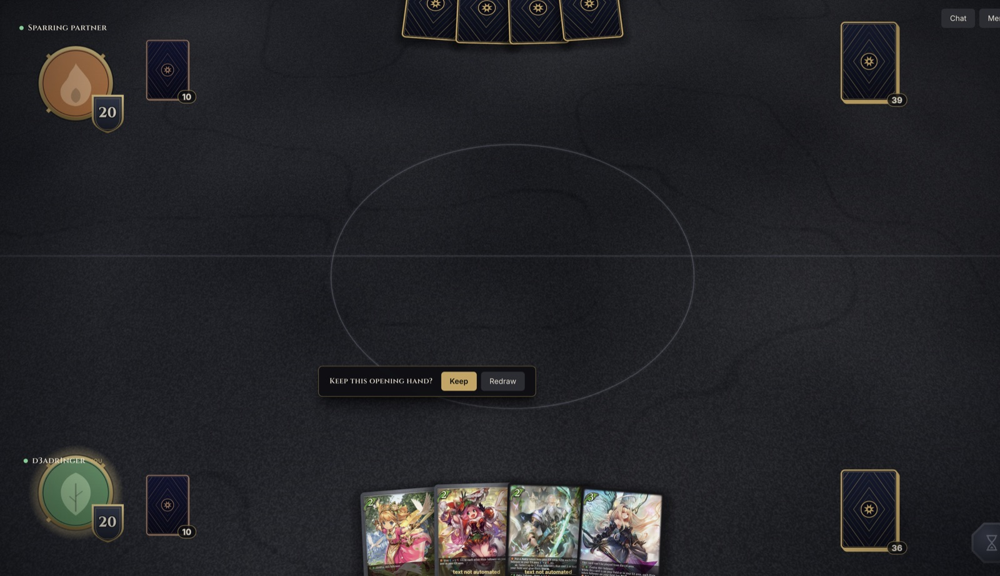
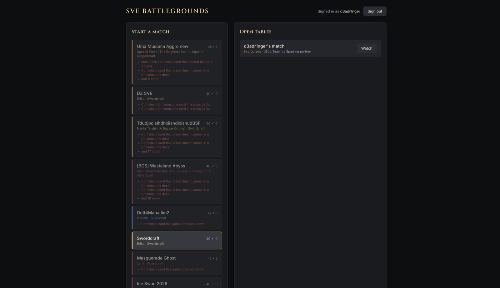
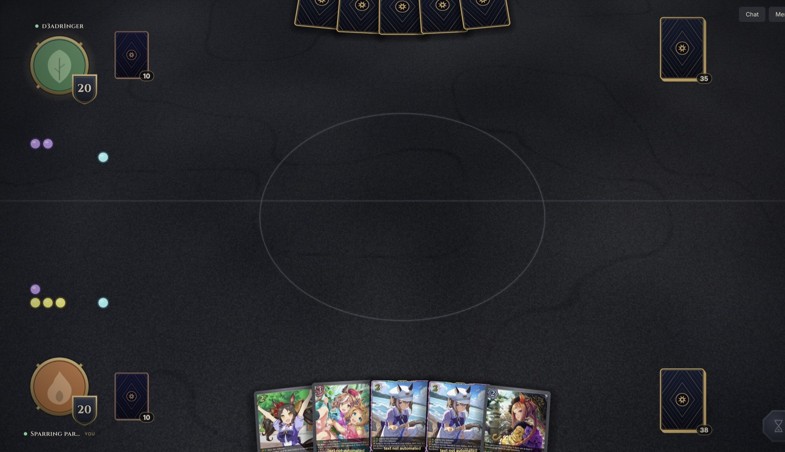
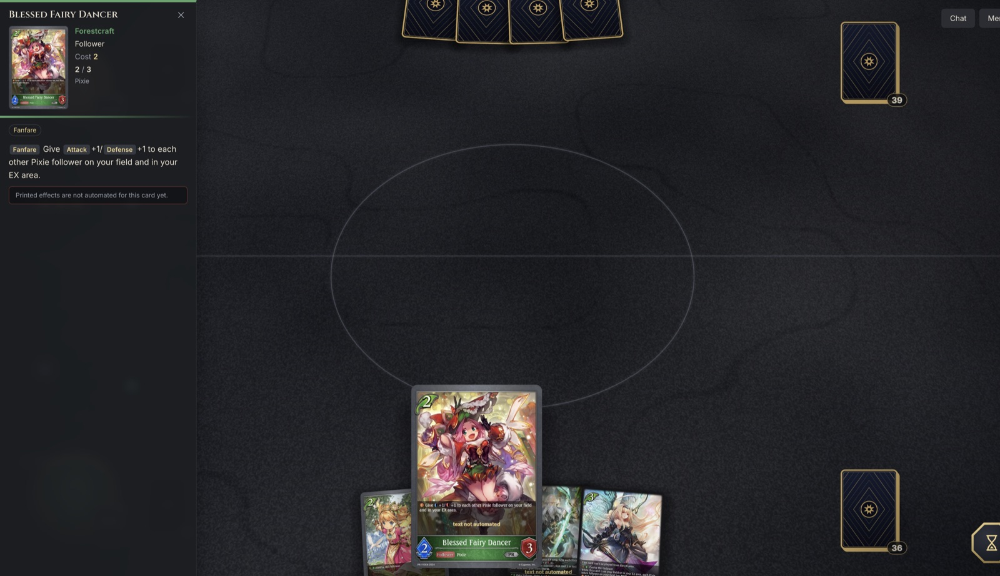
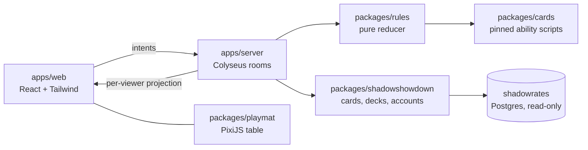

<div align="center">

# SVE Battlegrounds

**A one-on-one [Shadowverse: Evolve](https://en.shadowverse-evolve.com/) table in your browser.**
<br />
Server-authoritative rules, a PixiJS playmat, and real decks from shadowshowdown.com.




</div>

---

## What it is

Two players sit at a table, each in their own browser tab, and play a real match of Shadowverse:
Evolve against each other. The rules run on the server; the browser only draws the table and sends
intents ("play this", "attack that", "pass"). Hidden information never leaves the server: every
connection gets a projection of the match for its own role.

> **Status: playable slice.** You can play cards, attack, evolve, trigger abilities, search the deck,
> respond with Quick cards and race Umamusume followers. Not every card is automated yet, see the
> [roadmap](ROADMAP.md). Cards without a script still play as plain bodies and wear a
> "text not automated" badge.

## Screenshots

|                                                                                                  |                                                                                                         |
| ------------------------------------------------------------------------------------------------ | ------------------------------------------------------------------------------------------------------- |
| <br />**Lobby**: pick a deck, open a table or sit at one.    | <br />**The table**: your hand, resources, EX, and the evolve deck. |
| <br />**Opening hand**: keep or redraw, in turn order. | <br />**Card text**: hover a card to read it.          |

### Reading cards

Hover any face-up card and its text opens in a panel beside the table: art, class, cost, current
ATK/DEF, traits, keywords and the full, scrollable rules text. Move the pointer onto the panel to
scroll it. Close it with the `✕` button or `Esc`. If the card you are reading is on the left, the
panel moves to the right edge so it never covers it.

## What you can do

- **Play** followers, spells and amulets from hand or EX, paying play points (10.6).
- **Attack** with Storm, Rush, Ward, Assail, Intimidate, Drain and Bane; Aura is honoured.
  Rules handling and token elimination run in Confirmation Timing (11.3 to 11.6).
- **Evolve and super-evolve**, with evolution points or play points, once per turn.
- **Abilities** written as data: Fanfare, Last Words, On Evolve, triggers, statics, durations,
  delayed triggers, and effect ordering when several abilities trigger at once.
- **Search**: deck search, look at the top _X_ cards, cemetery selection, bury the top card. A card
  browser handles the choosing.
- **Quick** windows after an attack and at the end phase, with a respond bar.
- **Umamusume** universe decks: Serve / Race, the race zone, Carrot as an alternate name, and a
  carrot badge on racing followers.
- **Spectate** a match (board only, or both hands for casting), chat at the table, concede, and
  reconnect within 120 seconds.

## Run it

```sh
pnpm install
pnpm dev          # game server on :2567, web app on :5173
```

Open <http://localhost:5173>. With nothing configured the server runs on a fixture gateway: sign in
as Alice, Bob or Carol. A session token is kept per browser tab, so **a second tab is a second
account**.

### Play a match on one machine

1. Open the app in two tabs. Sign in as a different account in each.
2. **Tab 1:** pick a deck and click **Create match**. You are now waiting for an opponent.
3. **Tab 2:** pick a deck, find the table under **Open tables** and click **Sit down**.
4. The match starts. One player chooses **Go first** or **Go second**, then each side picks
   **Keep** or **Redraw**.
5. On your turn, click a highlighted card for its actions (**Play**, **Evolve**, **Attack**). End the
   turn with the gold hourglass at the bottom right.

### Next to shadowrates (real cards and decks)

The game develops against the real card data in the shadowrates database. Start shadowrates once
(`sail up`), then:

```sh
cp .env.example .env     # put shadowrates' DB password in it (see shadowrates/.env)
docker compose up --build
```

Open <http://localhost:5180>. The stack is an OrbStack/Docker project of its own
(`sve-battlegrounds`) and joins the `shadowrates_sail` network only to reach its `pgsql` service, so it
shares none of shadowrates' ports (80, 5173, 5432, 6379, 8080). Host ports are `SVE_WEB_PORT` (5180)
and `SVE_SERVER_PORT` (2567).

- **Cards and decks** are read from the shadowrates tables over a read-only connection
  (`default_transaction_read_only`, a statement timeout, four connections). The game never writes
  there.
- **Sign-in** accepts shadowrates' own Sanctum tokens. With no `SHADOWSHOWDOWN_LOGIN_URL`, the
  sign-in page offers real accounts that own a playable deck, plus a **Sparring partner** who plays
  the first account's decks, so one person can fill both seats.
- **Card art** lives on S3, which sends no CORS headers, so the server proxies it at
  `/api/art/:file` with a small in-memory cache.
- **Universe decks** (Umamusume) play: every card must share the leader's universe, and classes do
  not apply (6.1.1.5.2). Other universes (Vanguard) are rejected until their setup exists.
- After pulling, run `docker compose run --rm deps` to bring the containers' dependencies in line
  with the lockfile. `patches/` holds a fix for `@colyseus/better-call` whose Node adapter ended
  responses before large bodies drained.

Without Docker, set `SHADOWRATES_DATABASE_URL` (and optionally `CARD_IMAGES_URL`) for the server and
run `pnpm dev`. Configuration examples are in `apps/server/.env.example` and
`apps/web/.env.example`.

## Develop

| Command             | What it does                                             |
| ------------------- | -------------------------------------------------------- |
| `pnpm dev`          | server on :2567 and web app on :5173, both watching      |
| `pnpm check`        | typecheck, lint and every test                           |
| `pnpm test`         | all tests (`pnpm test:watch` to iterate)                 |
| `pnpm build`        | production build of the server and the web app           |
| `pnpm format`       | Prettier                                                 |
| `pnpm dump:cards`   | refresh the card catalog cache from the shadowrates DB   |
| `pnpm dump:decks`   | refresh the pinned deck fixtures from the shadowrates DB |
| `pnpm new:card`     | scaffold a card's script from the cached catalog         |
| `pnpm gen:scripts`  | re-index the script files after adding or moving one     |
| `pnpm cards:status` | how many catalog cards have a script, per craft          |

Node 22 or newer.

### Card scripts

`packages/cards/fixtures/cards.json` caches **every card** of the shadowrates database (about 3,500
identities, 6,800 printings), so scripts are written and tested without a database and without any
deck. Each script is one file, `packages/cards/src/<craft>/<card-name>.ts`, filed by the craft
printed on the card (`neutral`, `forestcraft`, `swordcraft`, `runecraft`, `dragoncraft`,
`abysscraft`, `havencraft`) and named after the card, never after a deck or a product.

```sh
pnpm new:card "Aurelia, Blooming Blade"   # writes swordcraft/aurelia-blooming-blade.ts with the printed text
pnpm gen:scripts                          # index it
pnpm cards:status forestcraft             # what is still unscripted
```

A script holds abilities only: name, key and printed text come from the catalog (`scriptOf`), and
how many copies a deck plays comes from the deck. Decks (`fixtures/decks.json`) are just printing
ids and counts. Where decks and cards come from tomorrow (a player's own decks over Google sign-in,
the shared catalog over `GET /api/v1/cards`) is behind the `ShadowShowdownGateway`; see the roadmap.

## How it is put together



```
packages/rules          pure TypeScript: the rules engine and what each viewer may see
packages/cards          pinned ability scripts, keyed by card name + printed-text hash
packages/protocol       the wire: messages, schemas, the HTTP API contract
packages/shadowshowdown the boundary to shadowshowdown.com (HTTP, Postgres, dev fixture)
packages/playmat        the PixiJS table. The only code that draws a card
apps/server             Colyseus: rooms, auth, HTTP API, chat
apps/web                React + Tailwind chrome around the playmat
```

Dependencies point one way and ESLint enforces it: `rules` knows nothing about networking, `playmat`
knows nothing about React, and only `apps/web` touches the Colyseus client.

**The server is the only source of truth.** The engine is a pure reducer, `reduce(state, action)`,
over an event log with a seeded RNG that stays on the server. Legal moves are listed in the open
prompt (`main`, `quickWindow`), so the client never computes legality. Hidden cards are absent from
a viewer's payload rather than blanked, and card definitions are not in match events at all: the
browser fetches them from `/api/cards`, so one player never learns the other's list from the wire.

**Abilities are data, not code.** A typed DSL in `packages/rules/src/abilities` describes triggers,
costs and effects. Per-card scripts live in `packages/cards` and are keyed by the card name plus a
hash of its normalized printed text, so a reprint with different text never silently picks up the
wrong script. Scripts are pinned into the match's first event, which means replays do not depend on
later code changes. Evolve and Serve costs are parsed from the printed text for every card.

**The table is a function of the view.** `@sve/playmat` computes a layout from a `MatchView`,
reconciles actors against it, and animates by diffing layouts. The camera looks across the table at
46 degrees and each card is a perspective quad. Events only add short cues (a shuffle, a resource
change, the turn banner). Cards never exist in the DOM; React owns everything else (sign-in, lobby,
the prompt bar, the action menu, the card browser, the card text panel, chat).

### The wire

- Public presence (who sits where, who is connected) is Colyseus schema state.
- Everything per-viewer is a message: `match.snapshot`, `match.events`, `match.rejected`,
  `chat.message`, `chat.history`. The client applies events only when their `fromSeq` is the
  sequence it holds, and asks for a fresh snapshot otherwise.
- A dropped player has 120 seconds to come back; a reload resumes the seat from the tab.

### Testing

The rules package carries most of the weight: unit tests for each step of the turn structure, play,
attack, evolve and effect ordering, plus random-playout property tests that play whole matches
between the two pinned decks and check that folding the projected events always equals the
projection. The server has room-level tests (leak checks, reconnect, mixed mulligans), the playmat
tests cover layout and cues, and the web tests cover prompt models and text formatting.

## shadowshowdown.com

The real API is not finished, so everything we expect of it is written in one place:
`packages/shadowshowdown/src/contract.ts`. When the API ships, that file and `http.ts` are the only
ones that change.

| Need          | Assumed                                                                     |
| ------------- | --------------------------------------------------------------------------- |
| Who is this   | `GET /api/v1/me` with `Authorization: Bearer <token>`                       |
| Their decks   | `GET /api/v1/decks?game=sve`, `GET /api/v1/decks/:id`                       |
| The card list | `GET /api/v1/cards?game=sve`                                                |
| Signing in    | redirect to `/login?redirect=<url>`; the token returns as `#access_token=…` |

Set `SHADOWSHOWDOWN_URL` on the server to use the real site. The fixture gateway refuses to start in
production, and so does the database gateway unless `SHADOWSHOWDOWN_LOGIN_URL` is set. Until the API
ships, `SHADOWRATES_DATABASE_URL` stands in for it, with the card mapping in
`packages/shadowshowdown/src/postgres/`.

## Roadmap

See [ROADMAP.md](ROADMAP.md) for what is left: full deck fidelity, more cards, rules gaps, polish,
persistence and replays.

## Rules and credits

Implemented against the Shadowverse: Evolve Comprehensive Rules (v1.23.0). The rules document is not
bundled in this repository. Shadowverse: Evolve is a trademark of its owners; this is an unofficial
fan project and ships no card art of its own.

Released under the [MIT License](LICENSE).
